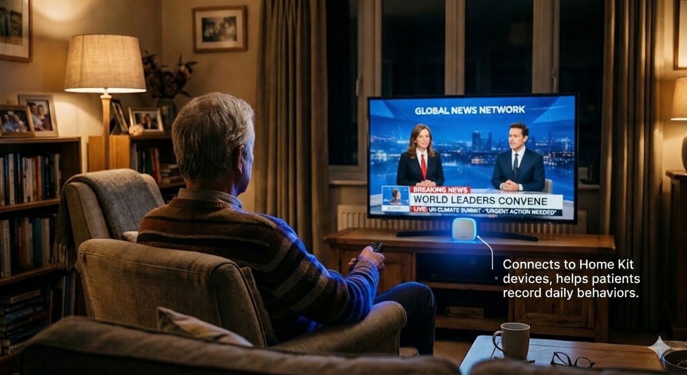

# 

# MemoCare — Alzheimer's Memory Assistant

MemoCare is an experimental project exploring how augmented reality, voice interaction, and AI-powered long-term memory can work together to support people living with Alzheimer's disease.

It currently runs on iPhone as a development prototype. However, a handheld phone is not the ideal form factor for patients with cognitive decline — the vision for this project is that these capabilities will truly shine on **future AR glasses**, where memory assistance becomes ambient, always-on, and hands-free.

The app has two distinct interfaces: a simplified **Patient Mode** for daily use, and a secure **Caregiver Mode** for care management.

## MemoCare on TestFlight

<p align="center">
  
</p>

You can download the beta app through TestFlight.

<p align="center">
  <a href="https://testflight.apple.com/join/pjsZeSgw">
    
  </a>
</p>

> **Requirements:** iPhone running iOS 26 or later.
> Tap the link above to install.

### Recommended: Download Enhanced Voices

MemoCare uses text-to-speech extensively to communicate with the patient. The default system voices sound robotic — for a much more natural experience, download an **Enhanced** or **Premium** voice:

1. Open **Settings → Accessibility → Read & Speak → Voices**
2. Select the language you use to talk to the assistant (e.g., Chinese (Simplified), English, etc.)
3. Tap any voice marked **Enhanced** — download it (about 100–400 MB)
4. Once installed, MemoCare will automatically use the higher-quality voice

---

[Project Demo Video](https://youtu.be/kGIt4n-ULwQ)

## Patient Mode

The patient interface is designed to be **radically simple** — no menus, no text input, no complex navigation. Just a full-screen camera with a few large buttons. The patient only needs to tap or speak. Everything else happens automatically behind the scenes.

At its core, MemoCare is a **memory system**. Everything in the patient interface exists to help record, retrieve, and reinforce the memories that Alzheimer's gradually takes away.

Powered by [EverMemOS](https://github.com/EverMind-AI/EverMemOS), MemoCare builds a persistent, structured long-term memory for each patient — not a chat history, but a living knowledge base of who they know, what they did, where they put things, and when they took their medication. Unlike LLM context windows that forget after each session, this memory accumulates over days and weeks, enabling the kind of precise, personalized care that Alzheimer's patients need.

### Recording Memories

Memories flow into the system from multiple sources — some require a single tap, others happen automatically in the background.

**Item Recording** — One tap captures what the patient is looking at. The camera recognizes the item via Gemini AI (e.g., keys, glasses, medication) and uses ARKit to save its precise position in 3D space as a spatial anchor. The item is associated with the current room and can be relocated later using the saved AR world map.

**Face Recognition** — A dedicated button identifies the person in front of the camera using an on-device [ArcFace](https://github.com/deepinsight/insightface) CoreML model. It generates a 512-dimensional face embedding, matches it against enrolled contacts, and announces the result by voice ("This is your daughter, Annie"). Each encounter is recorded as a memory.

**Smart Home Sensors** — MemoCare integrates with HomeKit-compatible accessories to passively observe daily behavior with no manual input:


- **Motion sensors** (e.g., Eve Motion) track which rooms the patient visits and when
- **Smart plugs** (e.g., Eve Energy) detect appliance usage — a kettle, TV, or microwave — logging what the patient does and at what time
- Works with any HomeKit-compatible accessory

**Room Awareness** — The app automatically detects which room the patient is in and displays a location badge. This room context helps organize items and provides situational awareness to the AI assistant.

All of these — items, faces, sensor events, locations — are continuously written into the patient's long-term memory, building a richer and more useful picture over time.

### Retrieving Memories

When the patient needs to recall something, multiple retrieval paths are available.

**Voice Chat Assistant** — The patient holds a button to speak, and the AI companion responds with voice. It searches the patient's accumulated memory to answer questions like "Did I take my medication?", "Where are my keys?", or "Who visited me today?". It can also identify people currently visible through the camera and help the patient make phone calls.

**Item Finding** — Select a previously recorded item from a list organized by room. AR-based distance guidance leads the patient to the item's saved location in real time.

### Reinforcing Memories

**Daily Memory Practice** — A flashcard exercise to strengthen recall of important facts: family members, daily routines, personal information. Questions are read aloud, answers revealed on tap. Progress is tracked with correct/incorrect scoring and gentle encouragement.

Cards are auto-generated from the patient's actual data — contacts, saved items, medication plans — so the practice stays relevant to their real life.

---

## Caregiver Mode

Behind the patient's simple interface is a **full-featured management system** for caregivers. Protected by Face ID and a 4-digit PIN, it gives caregivers complete control over every aspect of the patient's care — from reviewing memories and managing medication to enrolling faces and mapping rooms.

### Today's Recommendations

AI-generated daily suggestions based on the patient's activity:

- Alerts for missed medication, repeated questions, or emotional distress
- Each recommendation includes context, priority level, and actionable advice
- Accept or dismiss suggestions to refine future recommendations

### Memory Review

Review and curate everything the patient has recorded:

- Approve, correct, or delete memory entries
- Edit content for accuracy (e.g., "Put keys on the table" → "Put keys on the living room coffee table")
- See original vs. corrected content side by side

### Memory Cards

Manage the flashcard pool used in daily practice:

- Auto-generated cards from contacts ("Who is Annie?"), items ("Where are the keys?"), and medication ("When do you take your blood pressure medication?")
- Create custom question-and-answer cards
- Enable or disable individual cards
- Track accuracy rates to identify areas that need reinforcement

### Medication Plans

Set up and manage the patient's medication schedule:

- Add medications with scheduled times
- Daily repeat option
- Track whether each dose has been confirmed

### Contact Management

Maintain a directory of people in the patient's life:

- Add contacts with name, relationship, phone number, and aliases
- **Face enrollment**: capture 5–10 photos per contact to enable face recognition
- Generate face embeddings on-device for privacy
- View enrollment status and manage face data

### Space Mapping

Build a spatial model of the patient's living environment:

- **AR room scanning**: walk through a room to create a 3D map
- Real-time quality feedback (feature point count, mapping status)
- Save room maps for item tracking and room detection
- Customize room emoji icons
- **HomeKit integration**: bind HomeKit rooms to discover and monitor smart home sensors (motion, door contact, outlet)

### Settings

- Switch between Patient and Caregiver mode
- Choose patient interface style: Combined (AR always on) or Split (separate feature cards)
- Configure backend and API connections
- Inject demo data for testing and demonstration

---

## EverMemOS — Memory Backend

MemoCare connects to [EverMemOS](https://github.com/EverMind-AI/EverMemOS), a long-term memory system for conversational AI agents. It stores, indexes, and retrieves the patient's memories — enabling the chat assistant to give personalized, context-aware answers.

Two deployment options are available:

### Local Deployment

Run the EverMemOS backend on your own machine or local network. Ideal for development, privacy-sensitive environments, or offline use.

- Set the base URL in Settings (e.g., `http://192.168.x.x:1995`)
- No API key required — direct connection to your local server
- Test the connection status from within the app

### Cloud API

Connect to a hosted EverMemOS instance using an authentication token.

- Enter your API token in Settings
- All memory sync and search requests are routed through the cloud endpoint

---

## Getting Started

### Requirements

- **Xcode 26+** on macOS
- **iOS 26+** on a physical iPhone (AR features require a real device)
- An Apple Developer account (for deploying to device)
- **Git LFS** — this repo includes a CoreML model tracked via LFS

### Clone & Build

```bash
git lfs install
git clone https://github.com/TonyLiangDesign/Memo.git
cd Memo
```

1. Open `Memo.xcodeproj` in Xcode.
2. Select your connected iPhone as the destination.
3. Build & Run. Dependencies are fetched automatically via Swift Package Manager.

### Configuration

In the app's Settings screen, configure the services you need:

| Service | Purpose |
|---------|---------|
| EverMemOS | Memory sync, search, and AI recommendations |
| DeepSeek API Key | Voice chat assistant |
| Gemini API Key | Camera-based item recognition |

---

## Privacy & Permissions

MemoCare requests the following system permissions. Each can be reviewed and revoked at any time in iOS Settings.

| Permission | Used For |
|------------|----------|
| **Camera** | AR scene tracking, item recording, face recognition, room scanning |
| **Microphone** | Voice input for the chat assistant |
| **Speech Recognition** | On-device speech-to-text for voice commands |
| **HomeKit** | Reading motion sensor and smart plug events for behavioral awareness |
| **Face ID** | Caregiver authentication |

### Data Processing

**Processed entirely on-device:**
- Face detection, embedding, and recognition (ArcFace CoreML model)
- AR spatial mapping and item anchoring
- Speech-to-text transcription
- All SwiftData storage (memories, contacts, rooms, medication plans)
- HomeKit sensor event collection

**Sent to third-party services (only when configured):**
- **DeepSeek API** — voice chat messages and memory search context, for generating AI responses
- **Google Gemini API** — camera frame snapshots, for item recognition during recording
- **EverMemOS** — memory events, for long-term storage, indexing, and retrieval

No data is sent to any external service until you explicitly provide API keys or backend credentials in Settings. Without configuration, the app operates fully offline.

---

## Disclaimer

**This app is a research prototype and is not a medical device.** It is not intended to diagnose, treat, or replace professional medical care for Alzheimer's disease or any other condition. Always consult qualified healthcare professionals for medical decisions.

---

## Lessons Learned & Future Vision

### What We Learned

Building MemoCare taught us that **truly simple interfaces for cognitive decline require more intelligence, not less**. The patient interface has almost no buttons or text — but behind that simplicity is a complex system of AI detection, spatial computing, and ambient sensing.

**The paradox of simplicity**: To make the patient experience effortless, the system must work harder. Every tap-free interaction requires computer vision. Every voice command needs context-aware memory retrieval. Every automatic reminder depends on passive sensor fusion.

**Privacy vs. capability tension**: The most helpful features — continuous camera monitoring, ambient voice detection, predictive behavior analysis — are also the most privacy-invasive. Patients with Alzheimer's need constant support, but they also deserve dignity and autonomy.

### The Path Forward: Three Pillars of Privacy-First Care

The next generation of this system should operate as an **always-aware ambient assistant** — not a phone app you open, but an environment that watches, listens, and helps automatically. This vision rests on three architectural pillars:

**1. Cameras as Eyes**: Deploy multiple fixed cameras throughout the living space as the system's "eyes." Continuous visual monitoring enables:
- Automatic item tracking (no manual recording needed)
- Fall detection and safety alerts
- Behavioral pattern recognition (wandering, confusion, distress)
- Proactive assistance ("You're looking for your keys — they're on the kitchen counter")

**2. Local AI as Brain**: To protect patient privacy while maintaining intelligence, the entire AI stack should run on-premises using open-source models:
- **Local LLMs** (e.g., Llama, Mistral) for chat and reasoning
- **Local vision models** (e.g., YOLO, CLIP) for object and activity recognition
- **Local speech models** (e.g., Whisper) for voice transcription

This ensures that **no patient data ever leaves the home network** — no cloud APIs, no third-party services, no privacy compromises. The trade-off is higher upfront hardware cost (a local GPU server), but the long-term benefits are substantial: zero recurring API costs, complete data sovereignty, and offline operation.

**3. EverMemOS as Memory**: While LLMs provide reasoning and vision models provide perception, neither can remember. [EverMemOS](https://github.com/EverMind-AI/EverMemOS) serves as the system's long-term memory — a persistent, structured knowledge base that accumulates over weeks and months.

Unlike chat history or LLM context windows that reset after each conversation, EverMemOS maintains:
- **Episodic memory**: What happened, when, and where (e.g., "Took medication at 9:15 AM in the kitchen")
- **Semantic memory**: Facts about people, places, and routines (e.g., "Annie is your daughter, she visits on Sundays")
- **Procedural memory**: How to do things (e.g., "Your keys are usually on the hallway table")
- **Prospective memory**: What needs to happen (e.g., "Take blood pressure medication at 8 PM")

EverMemOS runs locally alongside the AI models, using open-source vector databases (Milvus, Qdrant) and search engines (Elasticsearch) for hybrid retrieval. It transforms raw observations from cameras and sensors into structured, searchable memories — enabling the AI to answer questions like "Did I eat lunch today?" or "When did I last see my son?" with precision, not hallucination.

**Memory is what makes the system truly useful.** Without it, the AI is just a smart camera that forgets everything. With it, the system becomes a genuine cognitive aid — a second brain that remembers when the patient's own memory fails.

**The ideal form factor**: AR glasses with outward-facing cameras become the patient's personal vision system, while fixed home cameras provide environmental awareness. The caregiver manages everything from a tablet or phone. The patient just lives their life — the system observes, remembers, and assists invisibly.

This is the future we're building toward: **maximum support with maximum privacy, powered by local AI and ambient sensing.**

## Contributing

Contributions are welcome. Please open an issue before submitting a pull request so we can discuss the approach first. Keep code style consistent with the existing codebase.

## License

All rights reserved. This project is not currently licensed for redistribution or reuse. A formal license may be added in the future.

## Acknowledgements

- [EverMemOSKit](https://github.com/AlexL1024/EverMemOSKit) — Swift SDK for the EverMemOS memory backend
- [InsightFace / ArcFace](https://github.com/deepinsight/insightface) — On-device face recognition model
- [DeepSeek](https://www.deepseek.com) — Chat completion API
- [Google Gemini](https://ai.google.dev) — Vision-based item recognition
